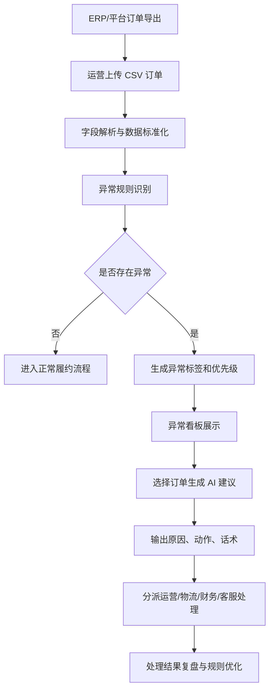
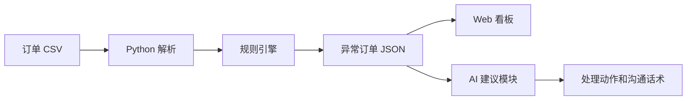

# 业务流程图

```mermaid
flowchart TD
    A["ERP/平台订单导出"] --> B["运营上传 CSV 订单"]
    B --> C["字段解析与数据标准化"]
    C --> D["异常规则识别"]
    D --> E{"是否存在异常"}
    E -->|否| F["进入正常履约流程"]
    E -->|是| G["生成异常标签和优先级"]
    G --> H["异常看板展示"]
    H --> I["选择订单生成 AI 建议"]
    I --> J["输出原因、动作、话术"]
    J --> K["分派运营/物流/财务/客服处理"]
    K --> L["处理结果复盘与规则优化"]
```

## 核心数据流

```mermaid
flowchart LR
    A["订单 CSV"] --> B["Python 解析"]
    B --> C["规则引擎"]
    C --> D["异常订单 JSON"]
    D --> E["Web 看板"]
    D --> F["AI 建议模块"]
    F --> G["处理动作和沟通话术"]
```
